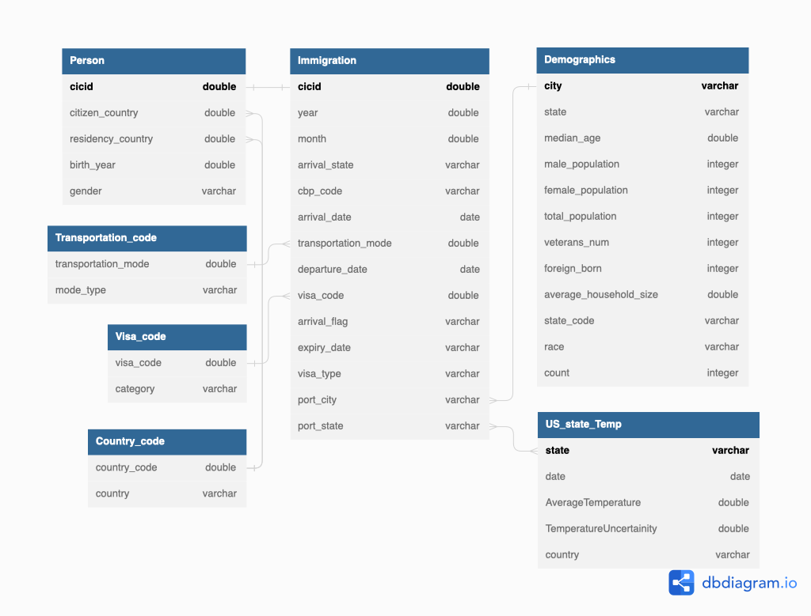

# Udacity_Data_Engineer_Nanodegree
  

## Capstone project: US Immigration Data Warehouse
This project builds up a data warehouse by integrating immigration data, demography data and temperature data together.
  
The project follows the follow steps:
### Step 1: Scope the Project and Gather Data

This project will integrate I94 immigration data, world temperature data and US demographic data to setup a data warehouse with fact and dimension tables.
##### Dataset
1. [I94 Immigration Data](https://www.trade.gov/national-travel-and-tourism-office)
> Data contains international visitor arrival statistics by world regions and select countries (including top 20), type of visa, mode of transportation, age groups, states visited (first intended address only), and the top ports of entry (for select countries).
2. [World Temperature Data](https://www.kaggle.com/datasets/berkeleyearth/climate-change-earth-surface-temperature-data)
> This dataset is from Kaggle and contains monthly average temperature data at different country in the world wide.
3. [U.S. City Demographic Data](https://public.opendatasoft.com/explore/dataset/us-cities-demographics/export/)
> This dataset contains information about the demographics of all US cities and census-designated places with a population greater or equal to 65,000.

### Step 2: Explore and Assess the Data
  
please see Capstone Project: [Capstone Project Template.ipynb](https://github.com/ulanliu/Udacity_Data_Engineer_Nanodegree/blob/main/Capstone%20Project/Capstone%20Project%20Template.ipynb)
### Step 3: Define the Data Model
  

* Step 4: Run ETL to Model the Data
  
[etl.py](https://github.com/ulanliu/Udacity_Data_Engineer_Nanodegree/blob/main/Capstone%20Project/etl.py)
